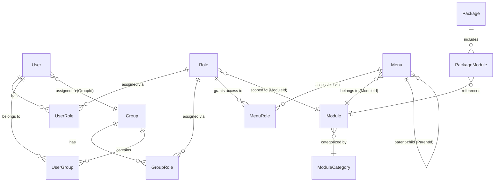

# Educ8eHost — Codebase Architecture & Feature Documentation

> **Solution**: `Lagetronix.School.sln`
> **Tech Stack**: ASP.NET MVC 5, Entity Framework 6 (Code-First), WCF Services, MEF (DI), ASP.NET Identity (OWIN), log4net

---

## Table of Contents

1. [High-Level Architecture](#1-high-level-architecture)
2. [Solution Layer Structure](#2-solution-layer-structure)
3. [Core Entities & Database Tables](#3-core-entities--database-tables)
4. [User Feature](#4-user-feature)
5. [Role Feature](#5-role-feature)
6. [Menu Feature](#6-menu-feature)
7. [Module Feature](#7-module-feature)
8. [Group Feature](#8-group-feature)
9. [Package & Licensing Feature](#9-package--licensing-feature)
10. [Security & Access Control Flow](#10-security--access-control-flow)
11. [Module Registration & Bootstrapping](#11-module-registration--bootstrapping)
12. [Menu Definition & Seeding](#12-menu-definition--seeding)
13. [Audit Trail](#13-audit-trail)
14. [Authentication (ServicePortal)](#14-authentication-serviceportal)
15. [Key Enums](#15-key-enums)
16. [Registered Business Modules](#16-registered-business-modules)

---

## 1. High-Level Architecture

```
┌───────────────────────────────────────────────────────────────┐
│                      Hosts (ServicePortal)                    │
│         ASP.NET MVC Controllers / Views / OWIN Auth           │
├───────────────────────────────────────────────────────────────┤
│                    Business Layer                             │
│    Managers (CoreManager, etc.) — WCF Service Contracts       │
├───────────────────────────────────────────────────────────────┤
│                     Data Layer                                │
│  EF DbContext (CoreContext) — Repository Pattern (MEF)        │
├───────────────────────────────────────────────────────────────┤
│                    Common Layer                               │
│   Entity Models, Enums, Contracts, PlaceHolders, Utils        │
├───────────────────────────────────────────────────────────────┤
│                  Integration Layer                            │
│              AuditTrail, External Services                    │
└───────────────────────────────────────────────────────────────┘
```

---

## 2. Solution Layer Structure

Each domain (Core, Admission, Assessment, etc.) follows a consistent pattern across layers:

| Layer                     | Project Naming Convention                          | Purpose                                     |
| ------------------------- | -------------------------------------------------- | ------------------------------------------- |
| **Common**                | `Lagetronix.School.Common.{Domain}`                | Entities, enums, domain constants           |
| **Common (Framework)**    | `Lagetronix.School.Framework.{Domain}`             | Framework extensions per domain             |
| **Data.Contract**         | `Lagetronix.School.Data.{Domain}.Contract`         | Repository interfaces, DTOs                 |
| **Data**                  | `Lagetronix.School.Data.{Domain}`                  | EF DbContext, repository implementations    |
| **Business.Contract**     | `Lagetronix.School.Business.{Domain}.Contract`     | WCF Service contracts, data contracts       |
| **Business**              | `Lagetronix.School.Business.{Domain}`              | Business managers (service implementations) |
| **Business.Bootstrapper** | `Lagetronix.School.Business.{Domain}.Bootstrapper` | MEF composition registration                |
| **Hosts**                 | `Lagetronix.School.Hosts.ServicePortal`            | ASP.NET MVC web application                 |

### Core Shared Project

`Lagetronix.School.Common` — contains cross-cutting concerns:

- `Contracts/` — `IIdentifiableEntity`, `IDataRepository`, `IServiceFactory`, etc.
- `PlaceHolder/` — `MenuPlaceHolder`, `RolePlaceHolder`, `MenuRolePlaceHolder` (seed data templates)
- `ServiceModel/` — `EntityBase`, `DataContractBase`, `DataConnector`, `ObjectBase`
- `Extensions/` — LINQ helpers (e.g., `ToFullyLoaded()`)
- `Exceptions/` — `NotFoundException`, etc.

---

## 3. Core Entities & Database Tables

All entities inherit from `EntityBase` (provides `CreatedBy`, `CreatedOn`, `UpdatedBy`, `UpdatedOn`, `RowVersion`) and implement `IIdentifiableEntity` (provides `EntityId`).

| Entity           | DB Table              | Primary Key        | Description                             |
| ---------------- | --------------------- | ------------------ | --------------------------------------- |
| `User`           | `cor_user`            | `UserId`           | System user accounts                    |
| `Role`           | `cor_role`            | `RoleId`           | Permission roles, scoped to a module    |
| `Menu`           | `cor_menu`            | `MenuId`           | Navigation menu items                   |
| `Module`         | `cor_module`          | `ModuleId`         | Application modules                     |
| `ModuleCategory` | `cor_module_category` | `ModuleCategoryId` | Module grouping categories              |
| `Group`          | `cor_group`           | `GroupId`          | User groups (e.g., Administrator, User) |
| `MenuRole`       | `cor_menurole`        | `MenuRoleId`       | Links menus to roles                    |
| `UserRole`       | `cor_user_role`       | `UserRoleId`       | Links users to roles                    |
| `UserGroup`      | `cor_usergroup`       | `UserGroupId`      | Links users to groups                   |
| `GroupRole`      | `cor_grouprole`       | `GroupRoleId`      | Links groups to roles                   |
| `Package`        | `cor_package`         | `PackageId`        | License packages                        |
| `PackageModule`  | `cor_package_module`  | `PackageModuleId`  | Links packages to modules               |
| `License`        | `cor_license`         | `LicenseId`        | License keys                            |
| `Configuration`  | `cor_configuration`   | `ConfigurationId`  | System configuration                    |
| `AuditTrail`     | `cor_audittrail`      | `AuditTrailId`     | Change tracking log                     |
| `Report`         | `cor_report`          | `ReportId`         | Report definitions per module           |

---

## 4. User Feature

### Entity: `User`

**File**: `Common/Lagetronix.School.Common.Core/Entities/User.cs`
**Table**: `cor_user`

| Property        | Type              | Required | Description                                                        |
| --------------- | ----------------- | -------- | ------------------------------------------------------------------ |
| `UserId`        | `long`            | PK       | Primary key                                                        |
| `FirstName`     | `string`          | ✅       | User's first name                                                  |
| `LastName`      | `string`          | ✅       | User's last name                                                   |
| `LoginID`       | `string`          | ✅       | Login username                                                     |
| `Password`      | `string`          | —        | Password (stored directly)                                         |
| `Email`         | `string`          | —        | Email address                                                      |
| `Mobile`        | `string`          | —        | Mobile phone                                                       |
| `UserType`      | `UserTypeEnum`    | ✅       | Staff / Student / Applicant / Parent                               |
| `EntityScope`   | `EntityScopeEnum` | ✅       | Access scope (University/Faculty/Dept/Program/NonAcademic/Student) |
| `ScopeCode`     | `string`          | ✅       | Code of the scope entity (e.g., department code)                   |
| `GroupId`       | `long`            | ✅       | FK → `cor_group`                                                   |
| `UserCode`      | `string`          | ✅       | Links to Staff (`hr_staff.Code`) or Student                        |
| `LastLoginDate` | `DateTime`        | —        | Timestamp of last login                                            |
| `IsLock`        | `bool`            | —        | Account locked flag                                                |
| `Active`        | `bool`            | —        | Active/inactive flag                                               |

### Data Contract: `UserData`

**File**: `Business/Lagetronix.School.Business.Core.Contract/Data Contracts/UserData.cs`

Flattened DTO adding: `GroupName`, `DepartmentCode`, `Department`, `Facebook`, `Skype`, `Image`.

### Repository: `UserRepository`

**File**: `Data/Lagetronix.School.Data.Core/Data Repositories/UserRepository.cs`

Key queries:

- `GetAllUserWithDepartment()` — joins `cor_user → cor_group → acp_academic_department → hr_staff`
- `GetUserProfile(loginID)` — joins `cor_user → hr_staff → hr_staff_photo → hr_employee_contact`
- `GetByLogin(loginID)` / `GetByEmail(email)` — simple lookups
- `GetCurrentStaffCode()` — resolves current login to staff code
- `GetCurrentStudentCode(login)` — resolves login → `adm_admission_account → std_student`

### Service Operations (via `ICoreService`)

- `UpdateUser`, `DeleteUser`, `GetUser`, `GetAllUsers`
- `GetAllUserWithDepartment` — returns `UserData[]`
- `GetUserByEmail`, `GetUserByLogin`, `GetUserProfile`

---

## 5. Role Feature

### Entity: `Role`

**File**: `Common/Lagetronix.School.Common.Core/Entities/Role.cs`
**Table**: `cor_role`

| Property      | Type     | Required | Description                                 |
| ------------- | -------- | -------- | ------------------------------------------- |
| `RoleId`      | `long`   | PK       | Primary key                                 |
| `Name`        | `string` | ✅       | Role name                                   |
| `ModuleId`    | `long`   | —        | FK → `cor_module` (roles are module-scoped) |
| `Description` | `string` | —        | Description                                 |
| `Active`      | `bool`   | —        | Active flag                                 |

### Data Contract: `RoleData`

Adds: `ModuleName`, `LongName` (formatted as `ModuleName - RoleName`).

### Default Roles (seeded per module)

Each module defines its own roles via `GetRoleDefinitions()`. The Core module defines:

- **Administrator** — unlimited access
- **User** — limited access

### Service Operations

- `UpdateRole`, `DeleteRole`, `GetRole`, `GetAllRoles`

---

## 6. Menu Feature

### Entity: `Menu`

**File**: `Common/Lagetronix.School.Common.Core/Entities/Menu.cs`
**Table**: `cor_menu`

| Property      | Type                   | Required | Description                                                         |
| ------------- | ---------------------- | -------- | ------------------------------------------------------------------- |
| `MenuId`      | `long`                 | PK       | Primary key                                                         |
| `Name`        | `string`               | ✅       | Internal name (e.g., `SETUP_COR`)                                   |
| `Code`        | `string`               | ✅       | Short code (e.g., `SEP_COR`)                                        |
| `Alias`       | `string`               | ✅       | Display label (e.g., "General Setup")                               |
| `AltName`     | `string`               | —        | Alternative display name                                            |
| `Action`      | `string`               | ✅       | MVC Action name (or `"None"` for parent-only items)                 |
| `Controller`  | `string`               | —        | MVC Controller name                                                 |
| `ModuleId`    | `long`                 | ✅       | FK → `cor_module`                                                   |
| `IsAvailable` | `MenuAvailabilityEnum` | —        | Controls visibility by school type (All/Tertiary/Secondary/Primary) |
| `ParentId`    | `long?`                | —        | FK → self (enables tree hierarchy)                                  |
| `Description` | `string`               | —        | Description                                                         |
| `ImageUrl`    | `string`               | —        | CSS icon class                                                      |
| `Image`       | `byte[]`               | —        | Binary image                                                        |
| `Position`    | `int?`                 | —        | Sort order within parent                                            |
| `Active`      | `bool`                 | —        | Active flag                                                         |

### Menu Hierarchy Structure

Menus form a **tree** via `ParentId` self-referencing:

```
General Setup (root, Position=0)
├── License
├── Countries
├── Languages
├── Religions
├── License Package
│   ├── Packages
│   └── Package Modules
├── Security
│   ├── Menus
│   ├── Roles
│   ├── Groups
│   ├── Users
│   ├── Change Password
│   └── User Roles
├── Theme
├── School Setup
│   ├── School Information
│   ├── Campus / Location *
│   ├── Program Type
│   ├── Faculty / School *
│   ├── Department
│   ├── Academic Position
│   ├── Level / Class *
│   ├── Academic Class
│   ├── Academic Section
│   └── Academic Award / Certification *
├── Calendar
│   ├── Session
│   └── School Event
├── Course / Subject Setup *
│   ├── Format
│   └── Course Type / Subject Type *
├── Scholarship & Grants
├── Academic School Category
└── Bank

Parameter (root, Position=1)
Report (root, Position=21)
```

> _Items marked with `_` have labels that vary based on school category (`TET` = Tertiary vs other).\*

### Menu Repository

**File**: `Data/Lagetronix.School.Data.Core/Data Repositories/MenuRepository.cs`

Key queries:

- `GetMenuByLogin(loginUser)` — retrieves menus accessible to a user by:
  1. Finding the user's roles via `cor_user_role → cor_user`
  2. Joining those roles to `cor_menurole → cor_menu`
  3. Returns only menus the user's roles grant access to
- `GetModuleMenuByPackage(packageCode)` — menus filtered by licensed package
- `GetModuleMenuByLogin(loginUser, modules)` — intersection of package modules and user roles
- `GetMenuByParentId(parentId)` — child menus for tree rendering

### Service Operations

- `UpdateMenu`, `DeleteMenu`, `GetMenu`, `GetAllMenus`
- `GetMenuByLogin(loginUser)` — role-filtered menus
- `GetModuleMenus(moduleId)` — menus within a module
- `GetMenuByParentId(parentId)` — child menus
- `GetPackageModuleMenu()` / `GetPackageModuleMenuByLogin(loginUser)` — package-filtered menus

---

## 7. Module Feature

### Entity: `Module`

**File**: `Common/Lagetronix.School.Common.Core/Entities/Module.cs`
**Table**: `cor_module`

| Property           | Type     | Required | Description                          |
| ------------------ | -------- | -------- | ------------------------------------ |
| `ModuleId`         | `long`   | PK       | Primary key                          |
| `Name`             | `string` | ✅       | Internal name (e.g., `CORE_SE`)      |
| `Code`             | `string` | ✅       | Short code (e.g., `MCRSE`)           |
| `Alias`            | `string` | ✅       | Display name (e.g., "Core")          |
| `ModuleCategoryId` | `long`   | ✅       | FK → `cor_module_category`           |
| `Description`      | `string` | —        | Description                          |
| `Version`          | `string` | —        | Version string (e.g., `"CORE v1.0"`) |
| `TestMode`         | `bool`   | —        | Whether module is in test mode       |
| `Active`           | `bool`   | —        | Active flag                          |

### Entity: `ModuleCategory`

**Table**: `cor_module_category`

Groups modules into categories. Properties: `ModuleCategoryId`, `Name`, `Code`, `Alias`, `Description`, `Active`.

### Service Operations

- `UpdateModule`, `DeleteModule`, `GetModule`, `GetAllModules`
- `ActivateModule`, `DeactivateModule` — toggle module availability
- `UpdateModuleCategory`, `DeleteModuleCategory`, `GetModuleCategory`, `GetAllModuleCategories`

---

## 8. Group Feature

### Entity: `Group`

**File**: `Common/Lagetronix.School.Common.Core/Entities/Group.cs`
**Table**: `cor_group`

| Property      | Type     | Description                                |
| ------------- | -------- | ------------------------------------------ |
| `GroupId`     | `long`   | PK                                         |
| `Name`        | `string` | Group name (e.g., "Administrator", "User") |
| `Description` | `string` | Description                                |
| `Active`      | `bool`   | Active flag                                |

### Junction Entities

#### `GroupRole` (Group ↔ Role)

**Table**: `cor_grouprole` — assigns roles to groups.

- `GroupRoleId` (PK), `GroupId` (FK), `RoleId` (FK), `Active`

#### `UserGroup` (User ↔ Group)

**Table**: `cor_usergroup` — assigns users to groups.

- `UserGroupId` (PK), `GroupId` (FK), `UserId` (FK), `Active`

### Service Operations

- `UpdateGroup`, `DeleteGroup`, `GetGroup`, `GetAllGroups`
- `UpdateGroupRole`, `DeleteGroupRole`, `GetGroupRole`, `GetGroupRoles(groupId)`
- `UpdateUserGroup`, `DeleteUserGroup`, `GetUserGroup`, `GetAllUserGroups`
- `CreateDefaultUserRole()` — seeds default user roles

---

## 9. Package & Licensing Feature

### Entity: `Package`

**Table**: `cor_package`

A bundle of modules that a school can subscribe to. Properties: `PackageId`, `Code`, `Name`, `Description`, `Active`.

### Entity: `PackageModule`

**Table**: `cor_package_module`

Links packages to modules.

- `PackageModuleId` (PK), `PackageId` (string FK), `ModuleId` (string FK), `Active`

### Entity: `License`

**Table**: `cor_license`

Stores license keys for validation. Properties: `LicenseId`, `Name`, `ValidationKey`, `LicenseKey`, `Active`.

### Entity: `Configuration`

**Table**: `cor_configuration`

System configuration linking category, package, and license. Properties: `ConfigurationId`, `CategoryId`, `PackageId`, `LicenseKey`, `Active`.

### How Licensing Works

1. `Configuration` stores which `PackageId` and `LicenseKey` the institution uses
2. `PackageModule` defines which modules are included in that package
3. Menu visibility is filtered by package → only modules in the active package show their menus
4. `LicenseValidator` checks the license key at startup

---

## 10. Security & Access Control Flow

The system uses a **Role-Based Access Control (RBAC)** model with the following relationships:



### Access Resolution (Menu Visibility)

When a user logs in, the system determines which menus to show:

1. **Get user's roles**: `cor_user_role` → find all `RoleId` for the user
2. **Get role-menu mappings**: `cor_menurole` → find all `MenuId` accessible by those roles
3. **Filter by package**: intersect with modules in the active `PackageModule` set
4. **Build menu tree**: render menus hierarchically using `ParentId`

### `AllowAccessToOperation` (Business Layer Security)

`CoreManager.AllowAccessToOperation()` validates that the current user's roles permit a given operation before executing business logic.

---

## 11. Module Registration & Bootstrapping

### Application Startup (`Global.asax.cs`)

At startup, the ServicePortal:

1. **Registers MEF catalogs**: each business module's `Bootstrapper.MEFLoader.Init()` is added to an `AggregateCatalog`, providing dependency injection for repository implementations
2. **Sets the container**: `ObjectBase.Container = new CompositionContainer(catalog)`
3. **Module registration** (commented out in current code): each manager's `RegisterModule()` would seed the database with module definitions, menus, and roles

### Module Registration Process (`CoreManager.RegisterModule()`)

When `RegisterModule()` runs for a domain module, it:

1. Creates/updates the `ModuleCategory` record
2. Creates/updates the `Module` record
3. Seeds **roles** from `GetRoleDefinitions()` (e.g., Administrator, User)
4. Seeds **menus** from `GetMenuDefinitions(category)` — builds the full menu tree
5. Seeds **menu-role** associations from `GetMenuRoleDefinitions()`

Each domain (Admission, Assessment, Financial, etc.) follows the same pattern via its own `*ModuleDefinitions` class and `*Manager.RegisterModule()`.

### PlaceHolder Classes (Seed Templates)

| Class                 | Properties                                                                                                                                  | Purpose                              |
| --------------------- | ------------------------------------------------------------------------------------------------------------------------------------------- | ------------------------------------ |
| `MenuPlaceHolder`     | `Code`, `Name`, `Alias`, `Action`, `Controller`, `ParentName`, `Description`, `Position`, `ImageUrl`, `Image`, `NotInModule`, `OwnerModule` | Template for seeding menu items      |
| `RolePlaceHolder`     | `Name`, `Description`                                                                                                                       | Template for seeding roles           |
| `MenuRolePlaceHolder` | `MenuName`, `RoleName`, `NotInModule`, `OwnerModule`                                                                                        | Template for seeding menu-role links |

---

## 12. Menu Definition & Seeding

### `CoreModuleDefinitions` (`Common/Lagetronix.School.Common.Core/CoreModuleDefinition.cs`)

This static class defines:

- **Module constants**: `MODULE_NAME = "CORE_SE"`, `MODULE_CODE = "MCRSE"`, `MODULE_VERSION = "CORE v1.0"`
- **Default groups**: `GROUP_ADMINISTRATOR = "Administrator"`, `GROUP_USER = "User"`
- **`GetRoleDefinitions()`**: returns `[Administrator, User]`
- **`GetMenuDefinitions(category)`**: returns the full menu tree (30+ items), adapting labels based on school category (Tertiary vs Secondary/Primary)
- **`GetMenuRoleDefinitions()`**: returns menu-role mappings (currently commented out — all menus are accessible)

### Category-Aware Labels

Menu labels change based on the `category` parameter:

| Tertiary (`"TET"`) | Non-Tertiary  |
| ------------------ | ------------- |
| Campus             | Location      |
| Faculty            | School        |
| Level              | Class         |
| Academic Award     | Certification |
| Course Setup       | Subject Setup |
| Course Type        | Subject Type  |

---

## 13. Audit Trail

### Entity: `AuditTrail`

**Table**: `cor_audittrail`

| Property            | Type          | Description              |
| ------------------- | ------------- | ------------------------ |
| `AuditTrailId`      | `long`        | PK                       |
| `RevisionStamp`     | `DateTime`    | When the change occurred |
| `TableName`         | `string`      | Which table was modified |
| `UserName`          | `string`      | Who made the change      |
| `IPAddress`         | `string`      | From where               |
| `Actions`           | `AuditAction` | Add / Modify / Delete    |
| `ActionDescription` | `string`      | Description              |
| `OldData`           | `string`      | Serialized old values    |
| `NewData`           | `string`      | Serialized new values    |
| `ChangedColumns`    | `string`      | Which columns changed    |

### How It Works

`CoreContext.SaveChanges()` is overridden to:

1. Set `CreatedBy`/`CreatedOn` for new entities
2. Set `UpdatedBy`/`UpdatedOn` for modified entities
3. Call `AuditManager.AddAudit()` to capture before/after state
4. Save audit records via `AuditManager.Save()`

---

## 14. Authentication (ServicePortal)

### Dual Authentication System

The application uses **two separate user systems**:

1. **ASP.NET Identity** (via `AccountController`)
   - Standard OWIN-based authentication: Login, Register, ForgotPassword, ResetPassword, 2FA, External Logins
   - Uses `ApplicationUserManager` and `ApplicationSignInManager`
   - Manages the web session (cookies)

2. **Custom User System** (via `ICoreService` / `CoreManager`)
   - `cor_user` table stores domain-specific user data (UserType, EntityScope, GroupId, etc.)
   - Links to `hr_staff` (for staff users) and `adm_admission_account` (for student users) via `UserCode`
   - Handles RBAC, menu visibility, and business authorization

### Login Flow

1. User authenticates via ASP.NET Identity (`AccountController.Login`)
2. After authentication, the system resolves the user's `LoginID` against `cor_user`
3. The user's roles are fetched from `cor_user_role`
4. Menus are built based on role-menu associations and active package modules

---

## 15. Key Enums

### `UserTypeEnum`

```
Staff = 1, Student = 2, Applicant = 3, Parent = 4
```

### `EntityScopeEnum`

```
UniversityPerson = 1, FacultyPerson = 2, DepartmentPerson = 3,
ProgramPerson = 4, NonAcademicPerson = 5, Student = 6
```

### `MenuAvailabilityEnum`

```
All = 1, Tertiary = 2, Secondary = 3, TertiaryAndSecondary = 4,
Primary = 5, SecondaryAndPrimary = 6
```

### `AuditAction`

```
Add, Modify, Delete
```

---

## 16. Registered Business Modules

The following modules are registered via MEF in `Global.asax.cs`:

| #   | Module              | Namespace Alias     | Business Manager            |
| --- | ------------------- | ------------------- | --------------------------- |
| 1   | Core                | `core`              | `CoreManager`               |
| 2   | Academic Plan       | `academicPlan`      | `AcademicPlanManager`       |
| 3   | Admission           | `admission`         | `AdmissionManager`          |
| 4   | Employee Directory  | `employeedirectory` | `EmployeeDirectoryManager`  |
| 5   | Student Directory   | `studentdirectory`  | `StudentDirectoryManager`   |
| 6   | Assessment          | `assessment`        | `AssessmentManager`         |
| 7   | Document Management | `doc`               | `DocMgManager`              |
| 8   | Attendance          | `attendance`        | `AttendanceManager`         |
| 9   | Leave               | `leave`             | `LeaveManager`              |
| 10  | Timetable           | `timeTable`         | `TimeTableManager`          |
| 11  | Examination         | `examination`       | `ExaminationManager`        |
| 12  | Result              | `result`            | `ResultManager`             |
| 13  | Library             | `library`           | `LibraryManager`            |
| 14  | Medical             | `medical`           | `MedicalManager`            |
| 15  | Communication       | `communication`     | `CommunicationManager`      |
| 16  | Financial           | `financial`         | `FinancialManager`          |
| 17  | Guardian Directory  | `guardianDir`       | `GuardianDirectoryManager`  |
| 18  | Discipline          | `displine`          | `DisciplineManager`         |
| 19  | Facility Management | `facility`          | `FacilityManagementManager` |
| 20  | Project             | `project`           | `ProjectManager`            |
| 21  | Hostel              | `hostel`            | `HostelManager`             |
| 22  | Inventory           | `inventory`         | `InventoryManager`          |

Each module follows the same pattern:

- **Common**: entities + module definition constants
- **Data.Contract**: repository interfaces + DTOs
- **Data**: EF repository implementations
- **Business.Contract**: WCF service contract + data contracts
- **Business**: Manager implementation
- **Business.Bootstrapper**: MEF loader

---

## Key File Quick Reference

| File                      | Path                                                                   | Purpose                                   |
| ------------------------- | ---------------------------------------------------------------------- | ----------------------------------------- |
| `User.cs`                 | `Common/Lagetronix.School.Common.Core/Entities/`                       | User entity model                         |
| `Role.cs`                 | `Common/Lagetronix.School.Common.Core/Entities/`                       | Role entity model                         |
| `Menu.cs`                 | `Common/Lagetronix.School.Common.Core/Entities/`                       | Menu entity model                         |
| `Module.cs`               | `Common/Lagetronix.School.Common.Core/Entities/`                       | Module entity model                       |
| `CoreModuleDefinition.cs` | `Common/Lagetronix.School.Common.Core/`                                | Menu/role seed definitions                |
| `CoreContext.cs`          | `Data/Lagetronix.School.Data.Core/`                                    | EF DbContext with table mappings          |
| `CoreManager.cs`          | `Business/Lagetronix.School.Business.Core/Managers/`                   | Business logic (3668 lines, 170 methods)  |
| `ICoreService.cs`         | `Business/Lagetronix.School.Business.Core.Contract/Service Contracts/` | WCF service interface                     |
| `MenuRepository.cs`       | `Data/Lagetronix.School.Data.Core/Data Repositories/`                  | Menu data access with role filtering      |
| `UserRepository.cs`       | `Data/Lagetronix.School.Data.Core/Data Repositories/`                  | User data access with staff/student joins |
| `Global.asax.cs`          | `Hosts/Lagetronix.School.Hosts.ServicePortal/`                         | App startup, MEF registration             |
| `AccountController.cs`    | `Hosts/Lagetronix.School.Hosts.ServicePortal/Controllers/`             | ASP.NET Identity authentication           |
| `Enums.cs`                | `Common/Lagetronix.School.Common.Core/Enum/`                           | Core enumerations                         |
