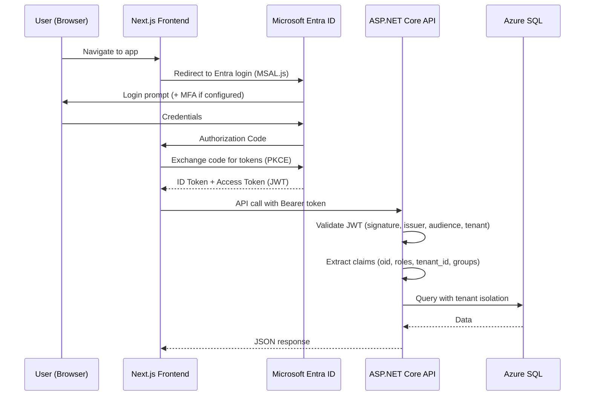
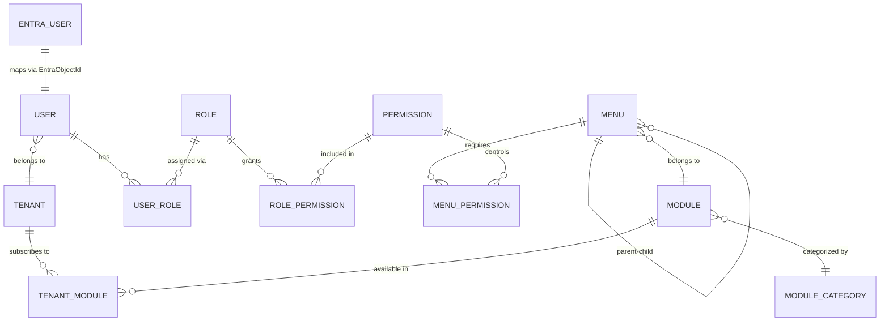

# IMS — Modernized Architecture & Feature Research

> **Purpose**: Adapt the legacy Educ8eHost school management system's user, role, menu, and feature management patterns for a **modern multi-tenant agriculture inventory management system (IMS)**, discarding outdated techniques and replacing with optimized, production-ready approaches.
>
> **Authentication**: Microsoft Entra ID (formerly Azure AD)
> **Tech Stack**: ASP.NET Core 8+ Web API, Entity Framework Core 8+, Azure SQL Database, Next.js (Frontend), Azure Services

---

## Table of Contents

1. [Legacy vs. Modern — Technology Migration Map](#1-legacy-vs-modern--technology-migration-map)
2. [High-Level Architecture](#2-high-level-architecture)
3. [Authentication — Azure Entra ID](#3-authentication--azure-entra-id)
4. [Authorization — Modern RBAC Model](#4-authorization--modern-rbac-model)
5. [Core Entities & Database Design](#5-core-entities--database-design)
6. [User Feature (Modernized)](#6-user-feature-modernized)
7. [Role & Permission Feature (Modernized)](#7-role--permission-feature-modernized)
8. [Menu & Navigation Feature (Modernized)](#8-menu--navigation-feature-modernized)
9. [Module Feature (Modernized)](#9-module-feature-modernized)
10. [Multi-Tenancy Architecture](#10-multi-tenancy-architecture)
11. [API Layer Design](#11-api-layer-design)
12. [Audit Trail (Modernized)](#12-audit-trail-modernized)
13. [Module Registration & Bootstrapping (Modernized)](#13-module-registration--bootstrapping-modernized)
14. [Security & Access Control Flow](#14-security--access-control-flow)
15. [IMS-Specific Modules & Features](#15-ims-specific-modules--features)
16. [Deployment & Infrastructure](#16-deployment--infrastructure)

---

## 1. Legacy vs. Modern — Technology Migration Map

The following table maps every outdated technology/pattern from the legacy system to its modern replacement. **All items in the "Discard" column are eliminated.**

| Area                       | ❌ Legacy (Discard)                                          | ✅ Modern Replacement                                         | Rationale                                               |
| -------------------------- | ------------------------------------------------------------ | ------------------------------------------------------------- | ------------------------------------------------------- |
| **Web Framework**          | ASP.NET MVC 5 (System.Web)                                   | ASP.NET Core 8+ Minimal APIs / Controllers                    | Cross-platform, high-performance Kestrel, built-in DI   |
| **Service Layer**          | WCF Services (SOAP/XML)                                      | RESTful Web API + gRPC (internal)                             | Industry standard, JSON, OpenAPI/Swagger                |
| **DI Framework**           | MEF (Managed Extensibility Framework)                        | Built-in ASP.NET Core DI (`IServiceCollection`)               | Native, faster, convention-based                        |
| **ORM**                    | Entity Framework 6 (Code-First)                              | Entity Framework Core 8+ (Code-First + Migrations)            | Performance, compiled queries, bulk ops, interceptors   |
| **Authentication**         | ASP.NET Identity + OWIN + Custom dual auth                   | **Microsoft Entra ID** (OAuth 2.0 / OIDC) via MSAL            | Zero password storage, SSO, MFA, Conditional Access     |
| **Session & Cookies**      | OWIN Cookie Auth + FormsAuth                                 | JWT Bearer Tokens (stateless)                                 | Scalable, stateless, multi-client support               |
| **App Startup**            | `Global.asax.cs` + OWIN Startup                              | `Program.cs` (Minimal Hosting)                                | Simplified, no XML config, pipeline clarity             |
| **Project Structure**      | 8 projects per domain (`.Contract`, `.Bootstrapper`, etc.)   | Clean Architecture (3-4 projects max)                         | Reduced complexity, faster builds                       |
| **Licensing/Packaging**    | Custom `cor_license` / `cor_package` tables + key validation | Tenant subscription via `Tenants` table + Azure feature flags | Simpler, SaaS-native, no custom key validation          |
| **Menu Seeding**           | PlaceHolder classes + `RegisterModule()` at startup          | EF Core Migrations + Seed Data (`HasData()`) or JSON config   | Repeatable, version-controlled, no runtime registration |
| **Configuration**          | `web.config` / `cor_configuration` table                     | `appsettings.json` + Azure App Configuration + Key Vault      | Hierarchical config, secrets management                 |
| **Logging**                | log4net                                                      | Serilog + Azure Application Insights                          | Structured logging, cloud-native telemetry              |
| **Enums for School Types** | `MenuAvailabilityEnum` (Tertiary/Secondary/Primary)          | **Not applicable** — IMS uses tenant `industry_type` field    | Domain-specific simplification                          |
| **Scope/User Types**       | `UserTypeEnum` (Staff/Student/Parent), `EntityScopeEnum`     | Entra ID Groups + App Roles (Admin/Manager/Staff/FieldWorker) | Identity-provider managed, no custom scoping            |

---

## 2. High-Level Architecture

```
┌──────────────────────────────────────────────────────────────────────────────────┐
│                              Client Layer                                        │
│         Next.js (SSR/PWA) │ Mobile (React Native / PWA)                          │
│         Barcode Scanner   │ E-Commerce Webhook Consumers                         │
├──────────────────────────────────────────────────────────────────────────────────┤
│                          Azure API Management                                    │
│                 Rate Limiting │ Throttling │ API Versioning                       │
├──────────────────────────────────────────────────────────────────────────────────┤
│                         ASP.NET Core 8+ Web API                                  │
│        Minimal APIs / Controllers │ MediatR (CQRS) │ FluentValidation            │
│        Background Jobs (Hangfire / Azure Functions)                               │
├─────────────┬───────────────────────────────────────┬────────────────────────────┤
│  Application│        Domain Layer                   │       Infrastructure       │
│    Services │   Entities │ Value Objects │ Enums     │   EF Core 8+ (Azure SQL)   │
│   DTOs/Maps │   Domain Services │ Specifications    │   Azure Blob Storage       │
│             │                                       │   Azure Redis Cache        │
│             │                                       │   Azure Service Bus        │
├─────────────┴───────────────────────────────────────┴────────────────────────────┤
│                          Cross-Cutting Concerns                                  │
│  Microsoft Entra ID (Auth) │ Serilog + App Insights │ Azure Key Vault            │
│  Multi-Tenant Middleware   │ Global Exception Handler │ Health Checks             │
└──────────────────────────────────────────────────────────────────────────────────┘
```

### Project Structure (Clean Architecture)

```
IMS/
├── src/
│   ├── IMS.Domain/                  # Entities, Enums, Value Objects, Domain Events
│   ├── IMS.Application/             # Use Cases, DTOs, Interfaces, Validators, Mappings
│   ├── IMS.Infrastructure/          # EF Core DbContext, Repos, External Services, Caching
│   └── IMS.API/                     # Controllers/Endpoints, Middleware, Program.cs
├── tests/
│   ├── IMS.UnitTests/
│   ├── IMS.IntegrationTests/
│   └── IMS.E2ETests/                # Playwright
└── IMS.sln
```

> **Key change**: The legacy system had **8 separate projects per domain module** (Common, Framework, Data.Contract, Data, Business.Contract, Business, Bootstrapper, Hosts). The modern approach uses **4 projects total** with feature folders inside each layer.

---

## 3. Authentication — Azure Entra ID

### Why Entra ID Replaces the Legacy Dual Auth System

The legacy system used a problematic **dual authentication model**:

1. ASP.NET Identity (OWIN) for web session cookies
2. Custom `cor_user` table for domain user data + RBAC

**Problems discarded**:

- Passwords stored in app database (even if hashed) — security liability
- Two separate user identity systems to synchronize
- No MFA, no Conditional Access, no SSO
- Custom session management via OWIN cookies

### Modern Auth Flow with Entra ID



### Entra ID Configuration

#### App Registration (Azure Portal)

| Setting                     | Value                                                                                                  |
| --------------------------- | ------------------------------------------------------------------------------------------------------ |
| **Application type**        | Single-page application (SPA) + Web API                                                                |
| **Redirect URIs**           | `https://app.domain.com/auth/callback`, `http://localhost:3000/auth/callback`                          |
| **API Permission Scopes**   | `api://{client-id}/Inventory.Read`, `api://{client-id}/Inventory.Write`, `api://{client-id}/Admin.All` |
| **App Roles**               | `Admin`, `Manager`, `Supervisor`, `Staff`, `FieldWorker`, `Accountant`                                 |
| **Token Configuration**     | Add optional claims: `email`, `given_name`, `family_name`                                              |
| **Supported account types** | Single tenant (or Multi-tenant for SaaS)                                                               |

#### Backend Configuration (`appsettings.json`)

```jsonc
{
  "AzureAd": {
    "Instance": "https://login.microsoftonline.com/",
    "TenantId": "<your-tenant-id>",
    "ClientId": "<your-api-client-id>",
    "Audience": "api://<your-api-client-id>",
    "CallbackPath": "/signin-oidc",
  },
}
```

#### Backend Auth Setup (`Program.cs`)

```csharp
// Authentication - Microsoft Entra ID
builder.Services.AddAuthentication(JwtBearerDefaults.AuthenticationScheme)
    .AddMicrosoftIdentityWebApi(builder.Configuration.GetSection("AzureAd"));

// Authorization policies
builder.Services.AddAuthorizationBuilder()
    .AddPolicy("AdminOnly", policy => policy.RequireRole("Admin"))
    .AddPolicy("ManagerOrAbove", policy => policy.RequireRole("Admin", "Manager"))
    .AddPolicy("InventoryWrite", policy =>
        policy.RequireClaim("scp", "Inventory.Write"))
    .AddPolicy("TenantAccess", policy =>
        policy.AddRequirements(new TenantAccessRequirement()));
```

#### Frontend Auth Setup (MSAL.js in Next.js)

```typescript
// authConfig.ts
import { Configuration, PublicClientApplication } from "@azure/msal-browser";

export const msalConfig: Configuration = {
  auth: {
    clientId: process.env.NEXT_PUBLIC_AZURE_CLIENT_ID!,
    authority: `https://login.microsoftonline.com/${process.env.NEXT_PUBLIC_AZURE_TENANT_ID}`,
    redirectUri: process.env.NEXT_PUBLIC_REDIRECT_URI,
  },
  cache: {
    cacheLocation: "sessionStorage",
    storeAuthStateInCookie: false,
  },
};

export const loginRequest = {
  scopes: [
    "api://<api-client-id>/Inventory.Read",
    "api://<api-client-id>/Inventory.Write",
  ],
};

export const msalInstance = new PublicClientApplication(msalConfig);
```

### User Provisioning Strategy

| Approach             | Description                                                                                                                                                                                 | Recommended For          |
| -------------------- | ------------------------------------------------------------------------------------------------------------------------------------------------------------------------------------------- | ------------------------ |
| **JIT Provisioning** | User record created in `Users` table on first API call. Claims from JWT token are used to populate `first_name`, `last_name`, `email`. Tenant resolved via custom claim or invitation link. | Most scenarios           |
| **Pre-provisioning** | Admin invites users via Entra ID. Azure Function triggered by Graph API events seeds the user into the DB.                                                                                  | Enterprise tenants       |
| **SCIM**             | Microsoft Entra ID auto-syncs user lifecycle (create/update/disable) via SCIM 2.0 endpoint.                                                                                                 | Large-scale multi-tenant |

### JIT Provisioning Middleware

```csharp
public class UserProvisioningMiddleware(RequestDelegate next)
{
    public async Task InvokeAsync(HttpContext context, ImsDbContext db)
    {
        if (context.User.Identity?.IsAuthenticated == true)
        {
            var oid = context.User.FindFirst("http://schemas.microsoft.com/identity/claims/objectidentifier")?.Value;
            var tenantClaim = context.User.FindFirst("tenant_id")?.Value;

            if (oid != null)
            {
                var user = await db.Users.FirstOrDefaultAsync(u => u.EntraObjectId == oid);
                if (user == null)
                {
                    user = new User
                    {
                        EntraObjectId = oid,
                        Email = context.User.FindFirst("email")?.Value ?? "",
                        FirstName = context.User.FindFirst("given_name")?.Value,
                        LastName = context.User.FindFirst("family_name")?.Value,
                        TenantId = int.Parse(tenantClaim ?? "0"),
                        IsActive = true,
                        CreatedAt = DateTime.UtcNow
                    };
                    db.Users.Add(user);
                    await db.SaveChangesAsync();
                }
                context.Items["CurrentUser"] = user;
                context.Items["TenantId"] = user.TenantId;
            }
        }
        await next(context);
    }
}
```

---

## 4. Authorization — Modern RBAC Model

### Comparison: Legacy vs. Modern

| Aspect            | Legacy                                       | Modern                                                  |
| ----------------- | -------------------------------------------- | ------------------------------------------------------- |
| Role storage      | `cor_role` table, module-scoped              | Entra ID App Roles + `Roles` table (for fine-grained)   |
| Role assignment   | `cor_user_role` junction table               | Entra ID group/role assignments + `UserRoles` table     |
| Menu visibility   | `cor_menurole` junction table                | `MenuPermissions` table + policy-based auth             |
| Group abstraction | `cor_group` + `cor_grouprole`                | Entra ID Security Groups (managed externally)           |
| Permission check  | `AllowAccessToOperation()` in business layer | `[Authorize(Policy = "...")]` + `IAuthorizationHandler` |

### RBAC Entity Relationships



### Key Design Decisions

1. **Entra ID App Roles for coarse-grained access** (Admin, Manager, Staff, etc.) — these are embedded in the JWT `roles` claim
2. **Database `Permissions` table for fine-grained access** (e.g., `inventory.items.create`, `inventory.items.delete`, `reports.stock.view`) — these are checked at the API level via authorization handlers
3. **No custom Group entity** — Entra ID Security Groups replace the legacy `cor_group` / `cor_usergroup` / `cor_grouprole` tables entirely

---

## 5. Core Entities & Database Design

### Base Entity (replaces legacy `EntityBase`)

```csharp
public abstract class BaseEntity
{
    public int Id { get; set; }
    public DateTime CreatedAt { get; set; } = DateTime.UtcNow;
    public string? CreatedBy { get; set; }       // Entra OID
    public DateTime? UpdatedAt { get; set; }
    public string? UpdatedBy { get; set; }       // Entra OID
    public bool IsDeleted { get; set; } = false; // Soft delete
    public byte[] RowVersion { get; set; } = [];  // Concurrency token
}

public abstract class TenantEntity : BaseEntity
{
    public int TenantId { get; set; }
    public Tenant Tenant { get; set; } = null!;
}
```

### Complete Entity Catalog

| Entity                 | DB Table                 | PK   | Scope  | Description                                              |
| ---------------------- | ------------------------ | ---- | ------ | -------------------------------------------------------- |
| `Tenant`               | `tenants`                | `Id` | Global | Multi-tenant root entity                                 |
| `User`                 | `users`                  | `Id` | Tenant | Provisioned from Entra ID, stores app-specific user data |
| `Role`                 | `roles`                  | `Id` | Tenant | Application roles (can extend Entra App Roles)           |
| `Permission`           | `permissions`            | `Id` | Global | Fine-grained permissions (`inventory.items.create`)      |
| `UserRole`             | `user_roles`             | `Id` | Tenant | Maps users → roles                                       |
| `RolePermission`       | `role_permissions`       | `Id` | Tenant | Maps roles → permissions                                 |
| `Module`               | `modules`                | `Id` | Global | Application feature modules                              |
| `ModuleCategory`       | `module_categories`      | `Id` | Global | Groups modules                                           |
| `TenantModule`         | `tenant_modules`         | `Id` | Tenant | Modules subscribed by tenant (replaces Package/License)  |
| `Menu`                 | `menus`                  | `Id` | Global | Navigation menu items                                    |
| `MenuPermission`       | `menu_permissions`       | `Id` | Global | Maps menus → required permissions                        |
| `Category`             | `categories`             | `Id` | Tenant | Product categories (hierarchical)                        |
| `Supplier`             | `suppliers`              | `Id` | Tenant | Supplier master                                          |
| `Location`             | `locations`              | `Id` | Tenant | Warehouses, fields, cold storage                         |
| `Item`                 | `items`                  | `Id` | Tenant | Core inventory items                                     |
| `ItemLocation`         | `item_locations`         | `Id` | Tenant | Stock quantities per location                            |
| `Batch`                | `batches`                | `Id` | Tenant | Batch/lot tracking                                       |
| `PurchaseOrder`        | `purchase_orders`        | `Id` | Tenant | Inbound orders                                           |
| `PurchaseOrderItem`    | `purchase_order_items`   | `Id` | Tenant | Line items for POs                                       |
| `SalesOrder`           | `sales_orders`           | `Id` | Tenant | Outbound orders                                          |
| `SalesOrderItem`       | `sales_order_items`      | `Id` | Tenant | Line items for SOs                                       |
| `InventoryTransaction` | `inventory_transactions` | `Id` | Tenant | Movement audit trail                                     |
| `AuditLog`             | `audit_logs`             | `Id` | Tenant | Full system audit trail                                  |

---

## 6. User Feature (Modernized)

### Entity: `User`

```csharp
public class User : TenantEntity
{
    public string EntraObjectId { get; set; } = "";  // Entra OID (unique, replaces LoginID)
    public string Email { get; set; } = "";
    public string? FirstName { get; set; }
    public string? LastName { get; set; }
    public string? Phone { get; set; }
    public string? AvatarUrl { get; set; }           // Azure Blob Storage URL
    public bool IsActive { get; set; } = true;
    public DateTime? LastLoginAt { get; set; }

    // Navigation
    public ICollection<UserRole> UserRoles { get; set; } = [];
}
```

### What Changed From Legacy

| Legacy Field                                | Status         | Modern Equivalent                  |
| ------------------------------------------- | -------------- | ---------------------------------- |
| `UserId` (long)                             | **Changed**    | `Id` (int, from `BaseEntity`)      |
| `LoginID`                                   | **Replaced**   | `EntraObjectId` — no local login   |
| `Password`                                  | **🗑️ Removed** | Entra ID manages credentials       |
| `UserType` (Staff/Student/Parent/Applicant) | **🗑️ Removed** | IMS uses Entra App Roles instead   |
| `EntityScope` + `ScopeCode`                 | **🗑️ Removed** | Not applicable to IMS              |
| `GroupId` (FK → cor_group)                  | **🗑️ Removed** | Entra Security Groups replace this |
| `UserCode` (Staff/Student link)             | **🗑️ Removed** | Domain-specific, not needed in IMS |
| `IsLock`                                    | **Renamed**    | `IsActive` (inverted semantics)    |
| `Active`                                    | **Kept**       | `IsActive`                         |
| `Email`, `Mobile`                           | **Kept**       | `Email`, `Phone`                   |

### API Endpoints

| Method   | Endpoint          | Auth Policy      | Description                       |
| -------- | ----------------- | ---------------- | --------------------------------- |
| `GET`    | `/api/users`      | `ManagerOrAbove` | List users for current tenant     |
| `GET`    | `/api/users/{id}` | `ManagerOrAbove` | Get user details                  |
| `GET`    | `/api/users/me`   | `Authenticated`  | Get current user profile          |
| `PUT`    | `/api/users/{id}` | `AdminOnly`      | Update user (role, active status) |
| `DELETE` | `/api/users/{id}` | `AdminOnly`      | Soft-delete user                  |

---

## 7. Role & Permission Feature (Modernized)

### Entity: `Role`

```csharp
public class Role : TenantEntity
{
    public string Name { get; set; } = "";        // e.g., "Inventory Manager"
    public string Code { get; set; } = "";        // e.g., "INV_MANAGER"
    public string? Description { get; set; }
    public bool IsSystem { get; set; } = false;   // Cannot be deleted if true
    public bool IsActive { get; set; } = true;

    // Navigation
    public ICollection<UserRole> UserRoles { get; set; } = [];
    public ICollection<RolePermission> RolePermissions { get; set; } = [];
}
```

### Entity: `Permission`

```csharp
public class Permission : BaseEntity  // Global, not tenant-scoped
{
    public string Name { get; set; } = "";       // e.g., "Create Items"
    public string Code { get; set; } = "";       // e.g., "inventory.items.create"
    public string? ModuleCode { get; set; }      // e.g., "INVENTORY" — groups permissions
    public string? Description { get; set; }

    public ICollection<RolePermission> RolePermissions { get; set; } = [];
}
```

### What Changed From Legacy

| Legacy Pattern                           | Modern Replacement                                                  |
| ---------------------------------------- | ------------------------------------------------------------------- |
| Roles scoped to Module via `ModuleId` FK | Permissions tagged with `ModuleCode` string; roles are tenant-level |
| `RolePlaceHolder` seed classes           | Permissions/roles seeded via EF Core `HasData()` in migrations      |
| `GetRoleDefinitions()` in each module    | Permissions defined once in a `PermissionConstants` static class    |
| `AllowAccessToOperation()` manual check  | `[Authorize(Policy = "...")]` + `PermissionAuthorizationHandler`    |

### Default Permissions (seeded)

```csharp
public static class Permissions
{
    // Inventory
    public const string ItemsView     = "inventory.items.view";
    public const string ItemsCreate   = "inventory.items.create";
    public const string ItemsEdit     = "inventory.items.edit";
    public const string ItemsDelete   = "inventory.items.delete";

    // Locations
    public const string LocationsView   = "inventory.locations.view";
    public const string LocationsManage = "inventory.locations.manage";
    public const string TransfersCreate = "inventory.transfers.create";

    // Orders
    public const string PurchaseOrdersView   = "orders.purchase.view";
    public const string PurchaseOrdersCreate = "orders.purchase.create";
    public const string SalesOrdersView      = "orders.sales.view";
    public const string SalesOrdersCreate    = "orders.sales.create";

    // Reports
    public const string ReportsView    = "reports.view";
    public const string ReportsExport  = "reports.export";

    // Administration
    public const string UsersManage    = "admin.users.manage";
    public const string RolesManage    = "admin.roles.manage";
    public const string SettingsManage = "admin.settings.manage";
    public const string AuditView      = "admin.audit.view";
}
```

### Permission-Based Authorization Handler

```csharp
public class PermissionRequirement(string permission) : IAuthorizationRequirement
{
    public string Permission { get; } = permission;
}

public class PermissionAuthorizationHandler(ImsDbContext db)
    : AuthorizationHandler<PermissionRequirement>
{
    protected override async Task HandleRequirementAsync(
        AuthorizationHandlerContext context,
        PermissionRequirement requirement)
    {
        var oid = context.User.FindFirst("oid")?.Value;
        if (oid == null) return;

        var hasPermission = await db.Users
            .Where(u => u.EntraObjectId == oid)
            .SelectMany(u => u.UserRoles)
            .SelectMany(ur => ur.Role.RolePermissions)
            .AnyAsync(rp => rp.Permission.Code == requirement.Permission);

        if (hasPermission)
            context.Succeed(requirement);
    }
}
```

---

## 8. Menu & Navigation Feature (Modernized)

### Entity: `Menu`

```csharp
public class Menu : BaseEntity  // Global, not tenant-scoped
{
    public string Name { get; set; } = "";        // Internal key, e.g., "INVENTORY_ITEMS"
    public string Label { get; set; } = "";       // Display label, e.g., "Items"
    public string? Icon { get; set; }             // Icon identifier, e.g., "package"
    public string? Route { get; set; }            // Frontend route, e.g., "/inventory/items"
    public int? ParentId { get; set; }            // Self-referencing FK for tree
    public string? ModuleCode { get; set; }       // Module this menu belongs to
    public int Position { get; set; } = 0;        // Sort order
    public bool IsActive { get; set; } = true;

    // Navigation
    public Menu? Parent { get; set; }
    public ICollection<Menu> Children { get; set; } = [];
    public ICollection<MenuPermission> MenuPermissions { get; set; } = [];
}
```

### What Changed From Legacy

| Legacy Field                       | Status         | Modern Equivalent                        |
| ---------------------------------- | -------------- | ---------------------------------------- |
| `Code`                             | **Merged**     | Into `Name` (single identifier)          |
| `Alias`                            | **Renamed**    | `Label` (clearer semantics)              |
| `Action` + `Controller` (MVC)      | **Replaced**   | `Route` (client-side route path)         |
| `AltName`                          | **🗑️ Removed** | Not needed                               |
| `IsAvailable` (school type filter) | **🗑️ Removed** | Not applicable to IMS                    |
| `ImageUrl` (CSS class)             | **Replaced**   | `Icon` (icon library reference)          |
| `Image` (byte[])                   | **🗑️ Removed** | Use icon library instead                 |
| `ModuleId` (FK)                    | **Replaced**   | `ModuleCode` (string reference, simpler) |
| `Description`                      | **🗑️ Removed** | Use tooltip on frontend                  |

### Menu Hierarchy for IMS

```
📊 Dashboard (root, Position=0)
    ├── Overview

📦 Inventory (root, Position=1)
    ├── Items
    ├── Categories
    ├── Batches & Lots
    ├── Stock Levels
    └── Barcode Scanner

🏗️ Locations (root, Position=2)
    ├── All Locations
    └── Stock Transfers

🚚 Suppliers (root, Position=3)
    ├── Supplier List
    └── Supplier Performance

📋 Orders (root, Position=4)
    ├── Purchase Orders
    ├── Sales Orders
    └── E-Commerce Sync

📈 Reports (root, Position=5)
    ├── Stock Report
    ├── Expiration Alerts
    ├── Movement History
    ├── Sales Trends
    └── Traceability / Batch History

⚙️ Administration (root, Position=6)
    ├── Users
    ├── Roles & Permissions
    ├── Modules
    ├── Tenant Settings
    └── Audit Logs
```

### Menu Resolution (API)

```csharp
// GET /api/menus/my-menus — returns menu tree filtered by user's permissions
public async Task<IActionResult> GetMyMenus()
{
    var oid = User.FindFirst("oid")?.Value;
    var tenantId = GetCurrentTenantId();

    // 1. Get user's permission codes
    var userPermissions = await _db.Users
        .Where(u => u.EntraObjectId == oid && u.TenantId == tenantId)
        .SelectMany(u => u.UserRoles)
        .SelectMany(ur => ur.Role.RolePermissions)
        .Select(rp => rp.Permission.Code)
        .Distinct()
        .ToListAsync();

    // 2. Get tenant's active modules
    var tenantModules = await _db.TenantModules
        .Where(tm => tm.TenantId == tenantId && tm.IsActive)
        .Select(tm => tm.Module.Code)
        .ToListAsync();

    // 3. Filter menus by permissions AND tenant modules
    var allMenus = await _db.Menus
        .Where(m => m.IsActive)
        .Where(m => m.ModuleCode == null || tenantModules.Contains(m.ModuleCode))
        .Include(m => m.MenuPermissions).ThenInclude(mp => mp.Permission)
        .ToListAsync();

    var accessibleMenus = allMenus
        .Where(m => !m.MenuPermissions.Any() ||
                     m.MenuPermissions.Any(mp => userPermissions.Contains(mp.Permission.Code)))
        .ToList();

    // 4. Build tree
    var menuTree = BuildMenuTree(accessibleMenus, parentId: null);
    return Ok(menuTree);
}
```

---

## 9. Module Feature (Modernized)

### Entity: `Module`

```csharp
public class Module : BaseEntity  // Global
{
    public string Name { get; set; } = "";        // e.g., "Inventory Management"
    public string Code { get; set; } = "";        // e.g., "INVENTORY"
    public string? Description { get; set; }
    public string? Version { get; set; }
    public int? CategoryId { get; set; }
    public bool IsActive { get; set; } = true;

    public ModuleCategory? Category { get; set; }
    public ICollection<TenantModule> TenantModules { get; set; } = [];
}
```

### TenantModule (replaces Package + PackageModule + License)

```csharp
public class TenantModule : TenantEntity
{
    public int ModuleId { get; set; }
    public bool IsActive { get; set; } = true;
    public DateTime? ActivatedAt { get; set; }
    public DateTime? ExpiresAt { get; set; }       // Subscription expiry

    public Module Module { get; set; } = null!;
}
```

### What Changed From Legacy

| Legacy Entity    | Status          | Modern Equivalent                            |
| ---------------- | --------------- | -------------------------------------------- |
| `Module`         | **Simplified**  | Same concept, cleaner properties             |
| `ModuleCategory` | **Kept**        | Same concept                                 |
| `Package`        | **🗑️ Removed**  | Replaced by `Tenant.SubscriptionPlan`        |
| `PackageModule`  | **🗑️ Replaced** | `TenantModule` — direct tenant↔module link   |
| `License`        | **🗑️ Removed**  | No custom license key validation             |
| `Configuration`  | **🗑️ Removed**  | `appsettings.json` + Azure App Configuration |

### Default IMS Modules

| Code          | Name                          | Category     |
| ------------- | ----------------------------- | ------------ |
| `CORE`        | Core & Administration         | Core         |
| `INVENTORY`   | Inventory Management          | Operations   |
| `WAREHOUSE`   | Warehouse & Locations         | Operations   |
| `PROCUREMENT` | Procurement & Purchase Orders | Supply Chain |
| `SALES`       | Sales & Order Management      | Sales        |
| `SUPPLIERS`   | Supplier Management           | Supply Chain |
| `REPORTS`     | Reporting & Analytics         | Intelligence |
| `ECOMMERCE`   | E-Commerce Integration        | Integrations |
| `BARCODE`     | Barcode & Scanning            | Operations   |

---

## 10. Multi-Tenancy Architecture

### Strategy: Single Database with `TenantId` Column

Chosen over schema-per-tenant or database-per-tenant for cost-effectiveness at the 500–1000 user scale.

### Tenant Resolution

```csharp
public class TenantMiddleware(RequestDelegate next)
{
    public async Task InvokeAsync(HttpContext context, ImsDbContext db)
    {
        // Option 1: From JWT custom claim
        var tenantClaim = context.User.FindFirst("tenant_id")?.Value;

        // Option 2: From request header (for multi-tenant SaaS)
        tenantClaim ??= context.Request.Headers["X-Tenant-Id"].FirstOrDefault();

        // Option 3: From subdomain (farm1.app.com → farm1)
        tenantClaim ??= ResolveTenantFromHost(context.Request.Host);

        if (int.TryParse(tenantClaim, out var tenantId))
        {
            context.Items["TenantId"] = tenantId;
        }

        await next(context);
    }
}
```

### EF Core Global Query Filter

```csharp
// ImsDbContext.cs
protected override void OnModelCreating(ModelBuilder modelBuilder)
{
    // Automatically filter ALL tenant-scoped entities
    foreach (var entityType in modelBuilder.Model.GetEntityTypes())
    {
        if (typeof(TenantEntity).IsAssignableFrom(entityType.ClrType))
        {
            modelBuilder.Entity(entityType.ClrType)
                .HasQueryFilter(
                    BuildTenantFilter(entityType.ClrType));
        }
    }
}

// Generates: e => e.TenantId == _currentTenantId && !e.IsDeleted
private LambdaExpression BuildTenantFilter(Type entityType) { /* ... */ }
```

### Azure SQL Row-Level Security (optional, defense in depth)

```sql
-- RLS policy ensures tenant isolation at the database level
CREATE SECURITY POLICY TenantPolicy
ADD FILTER PREDICATE dbo.fn_TenantFilter(tenant_id) ON dbo.items,
ADD FILTER PREDICATE dbo.fn_TenantFilter(tenant_id) ON dbo.users,
-- ... for all tenant-scoped tables
WITH (STATE = ON);
```

---

## 11. API Layer Design

### RESTful Endpoints Summary

| Module              | Endpoint                         | Methods                        |
| ------------------- | -------------------------------- | ------------------------------ |
| **Auth**            | `/api/auth/me`                   | `GET`                          |
| **Users**           | `/api/users`                     | `GET`, `PUT`, `DELETE`         |
| **Roles**           | `/api/roles`                     | `GET`, `POST`, `PUT`, `DELETE` |
| **Permissions**     | `/api/permissions`               | `GET`                          |
| **Menus**           | `/api/menus/my-menus`            | `GET`                          |
| **Items**           | `/api/items`                     | `GET`, `POST`, `PUT`, `DELETE` |
| **Items**           | `/api/items/{id}/stock`          | `GET`                          |
| **Items**           | `/api/items/scan`                | `POST`                         |
| **Categories**      | `/api/categories`                | `GET`, `POST`, `PUT`, `DELETE` |
| **Batches**         | `/api/batches`                   | `GET`, `POST`                  |
| **Locations**       | `/api/locations`                 | `GET`, `POST`, `PUT`, `DELETE` |
| **Transfers**       | `/api/transfers`                 | `POST`                         |
| **Suppliers**       | `/api/suppliers`                 | `GET`, `POST`, `PUT`, `DELETE` |
| **Purchase Orders** | `/api/purchase-orders`           | `GET`, `POST`, `PUT`           |
| **Sales Orders**    | `/api/sales-orders`              | `GET`, `POST`, `PUT`           |
| **Reports**         | `/api/reports/stock-levels`      | `GET`                          |
| **Reports**         | `/api/reports/expiration-alerts` | `GET`                          |
| **Reports**         | `/api/reports/movements`         | `GET`                          |
| **Integrations**    | `/api/integrations/ecom/sync`    | `POST` (webhook)               |
| **Audit**           | `/api/audit-logs`                | `GET`                          |
| **Tenant**          | `/api/tenant/settings`           | `GET`, `PUT`                   |

### API Conventions

```csharp
// Standard response envelope
public record ApiResponse<T>(
    bool Success,
    T? Data,
    string? Message,
    IEnumerable<string>? Errors
);

// Paginated response
public record PagedResponse<T>(
    IEnumerable<T> Items,
    int TotalCount,
    int Page,
    int PageSize
);
```

---

## 12. Audit Trail (Modernized)

### Entity: `AuditLog`

```csharp
public class AuditLog
{
    public long Id { get; set; }            // BIGINT for high volume
    public int TenantId { get; set; }
    public string? UserId { get; set; }     // Entra OID of the actor
    public string? UserEmail { get; set; }
    public string EntityName { get; set; } = "";   // e.g., "Item"
    public string? EntityId { get; set; }          // PK of the affected entity
    public string Action { get; set; } = "";       // Create, Update, Delete
    public string? OldValues { get; set; }         // JSON
    public string? NewValues { get; set; }         // JSON
    public string? ChangedProperties { get; set; } // JSON array
    public string? IpAddress { get; set; }
    public string? UserAgent { get; set; }
    public DateTime Timestamp { get; set; } = DateTime.UtcNow;
}
```

### What Changed From Legacy

| Legacy                                    | Modern                                                |
| ----------------------------------------- | ----------------------------------------------------- |
| `SaveChanges()` override in DbContext     | EF Core `SaveChangesInterceptor` (cleaner separation) |
| `AuditManager.AddAudit()` manual call     | Automatic via `ChangeTracker` inspection              |
| `TableName` (string)                      | `EntityName` (maps to C# class name)                  |
| `UserName` (login string)                 | `UserId` (Entra OID) + `UserEmail`                    |
| `OldData` / `NewData` (custom serialized) | JSON serialization via `System.Text.Json`             |

### EF Core Audit Interceptor

```csharp
public class AuditSaveChangesInterceptor(IHttpContextAccessor httpContext)
    : SaveChangesInterceptor
{
    public override async ValueTask<InterceptionResult<int>> SavingChangesAsync(
        DbContextEventData eventData,
        InterceptionResult<int> result,
        CancellationToken ct = default)
    {
        var context = eventData.Context;
        if (context == null) return await base.SavingChangesAsync(eventData, result, ct);

        var userId = httpContext.HttpContext?.User.FindFirst("oid")?.Value;
        var tenantId = httpContext.HttpContext?.Items["TenantId"] as int? ?? 0;

        foreach (var entry in context.ChangeTracker.Entries<BaseEntity>()
            .Where(e => e.State is EntityState.Added or EntityState.Modified or EntityState.Deleted))
        {
            var auditLog = new AuditLog
            {
                TenantId = tenantId,
                UserId = userId,
                EntityName = entry.Entity.GetType().Name,
                EntityId = entry.Property("Id").CurrentValue?.ToString(),
                Action = entry.State.ToString(),
                Timestamp = DateTime.UtcNow,
                IpAddress = httpContext.HttpContext?.Connection.RemoteIpAddress?.ToString()
            };

            if (entry.State == EntityState.Modified)
            {
                var changedProps = entry.Properties
                    .Where(p => p.IsModified)
                    .Select(p => p.Metadata.Name)
                    .ToList();

                auditLog.OldValues = JsonSerializer.Serialize(
                    entry.Properties.Where(p => p.IsModified)
                        .ToDictionary(p => p.Metadata.Name, p => p.OriginalValue));
                auditLog.NewValues = JsonSerializer.Serialize(
                    entry.Properties.Where(p => p.IsModified)
                        .ToDictionary(p => p.Metadata.Name, p => p.CurrentValue));
                auditLog.ChangedProperties = JsonSerializer.Serialize(changedProps);
            }

            context.Set<AuditLog>().Add(auditLog);
        }

        return await base.SavingChangesAsync(eventData, result, ct);
    }
}
```

---

## 13. Module Registration & Bootstrapping (Modernized)

### What Changed From Legacy

| Legacy                                             | Modern                                                                 |
| -------------------------------------------------- | ---------------------------------------------------------------------- |
| `Global.asax.cs` Application_Start                 | `Program.cs` with `WebApplication.CreateBuilder()`                     |
| MEF `AggregateCatalog` + `CompositionContainer`    | `builder.Services.AddScoped<>()` (built-in DI)                         |
| `RegisterModule()` at runtime per manager          | EF Core Migrations `HasData()` (one-time seed)                         |
| Each module has a `Bootstrapper.MEFLoader` project | **Eliminated** — DI registration in `Program.cs` via extension methods |

### Modern Service Registration (`Program.cs`)

```csharp
var builder = WebApplication.CreateBuilder(args);

// Authentication
builder.Services.AddAuthentication(JwtBearerDefaults.AuthenticationScheme)
    .AddMicrosoftIdentityWebApi(builder.Configuration.GetSection("AzureAd"));

// Authorization
builder.Services.AddAuthorization();
builder.Services.AddSingleton<IAuthorizationHandler, PermissionAuthorizationHandler>();

// Database
builder.Services.AddDbContext<ImsDbContext>(options =>
    options.UseSqlServer(builder.Configuration.GetConnectionString("DefaultConnection"),
        sql => sql.EnableRetryOnFailure()));

// Application Services (replaces MEF composition for ALL modules)
builder.Services.AddScoped<IItemService, ItemService>();
builder.Services.AddScoped<ILocationService, LocationService>();
builder.Services.AddScoped<IOrderService, OrderService>();
builder.Services.AddScoped<ISupplierService, SupplierService>();
builder.Services.AddScoped<IReportService, ReportService>();
builder.Services.AddScoped<IAuditService, AuditService>();

// Infrastructure
builder.Services.AddStackExchangeRedisCache(options =>
    options.Configuration = builder.Configuration.GetConnectionString("Redis"));
builder.Services.AddApplicationInsightsTelemetry();
builder.Services.AddHealthChecks()
    .AddSqlServer(builder.Configuration.GetConnectionString("DefaultConnection")!)
    .AddRedis(builder.Configuration.GetConnectionString("Redis")!);

var app = builder.Build();

// Middleware pipeline
app.UseHttpsRedirection();
app.UseCors("AllowFrontend");
app.UseAuthentication();
app.UseMiddleware<TenantMiddleware>();
app.UseMiddleware<UserProvisioningMiddleware>();
app.UseAuthorization();
app.MapControllers();
app.MapHealthChecks("/health");

app.Run();
```

### Database Seeding (replaces runtime `RegisterModule()`)

```csharp
// In ImsDbContext.OnModelCreating() or a separate IEntityTypeConfiguration
modelBuilder.Entity<Module>().HasData(
    new Module { Id = 1, Code = "CORE", Name = "Core & Administration", IsActive = true },
    new Module { Id = 2, Code = "INVENTORY", Name = "Inventory Management", IsActive = true },
    new Module { Id = 3, Code = "WAREHOUSE", Name = "Warehouse & Locations", IsActive = true },
    new Module { Id = 4, Code = "PROCUREMENT", Name = "Procurement", IsActive = true },
    new Module { Id = 5, Code = "SALES", Name = "Sales & Orders", IsActive = true },
    new Module { Id = 6, Code = "SUPPLIERS", Name = "Supplier Management", IsActive = true },
    new Module { Id = 7, Code = "REPORTS", Name = "Reporting & Analytics", IsActive = true }
);

modelBuilder.Entity<Permission>().HasData(
    new Permission { Id = 1,  Code = "inventory.items.view",    Name = "View Items",    ModuleCode = "INVENTORY" },
    new Permission { Id = 2,  Code = "inventory.items.create",  Name = "Create Items",  ModuleCode = "INVENTORY" },
    // ... all permissions seeded via migrations
);
```

---

## 14. Security & Access Control Flow

### Complete Access Resolution Flow

```mermaid
flowchart TD
    A[User opens app] --> B[MSAL.js redirects to Entra ID]
    B --> C{Authenticated?}
    C -->|No| D[Login page + MFA]
    D --> C
    C -->|Yes| E[JWT issued with roles & claims]
    E --> F[Frontend sends API request + Bearer token]
    F --> G[API validates JWT signature & claims]
    G --> H[TenantMiddleware resolves tenant_id]
    H --> I[UserProvisioningMiddleware ensures user exists]
    I --> J{Authorization check}
    J -->|[Authorize Policy]| K[PermissionAuthorizationHandler]
    K --> L{Has required permission?}
    L -->|Yes| M[Execute business logic with tenant filter]
    L -->|No| N[403 Forbidden]
    M --> O[EF Core global query filter applies tenant_id]
    O --> P[AuditInterceptor logs changes]
    P --> Q[Return response]
```

### Security Layers

| Layer               | Mechanism                          | Purpose                                        |
| ------------------- | ---------------------------------- | ---------------------------------------------- |
| **Network**         | Azure API Management + WAF         | DDoS/rate limiting, IP filtering               |
| **Transport**       | HTTPS/TLS 1.3 (enforced)           | Encryption in transit                          |
| **Identity**        | Microsoft Entra ID + MSAL          | Authentication, SSO, MFA, Conditional Access   |
| **API Auth**        | JWT Bearer validation              | Token signature/issuer/audience verification   |
| **Authorization**   | Policy-based + PermissionHandler   | Fine-grained RBAC                              |
| **Data Isolation**  | EF Core global query filters + RLS | Multi-tenant data enforcement                  |
| **Data Protection** | Azure SQL TDE + Azure Key Vault    | Encryption at rest, secrets management         |
| **Audit**           | EF Core interceptor → `audit_logs` | Full change tracking                           |
| **Secrets**         | Azure Key Vault                    | Connection strings, API keys (never in config) |

---

## 15. IMS-Specific Modules & Features

### Module Feature Map

| Module          | Key Features                                                             | Replaces Legacy                  |
| --------------- | ------------------------------------------------------------------------ | -------------------------------- |
| **Inventory**   | Items CRUD, SKU/barcode, batch/lot tracking, expiry alerts, stock levels | — (new)                          |
| **Warehouse**   | Multi-location management, stock transfers, capacity tracking            | — (new)                          |
| **Procurement** | Purchase orders, supplier selection, goods received                      | — (new)                          |
| **Sales**       | Sales orders, fulfillment, e-commerce sync                               | — (new)                          |
| **Suppliers**   | Supplier master, performance tracking, payment terms                     | — (new)                          |
| **Reports**     | Stock levels, expiration, movement history, batch traceability, trends   | Legacy `cor_report` (simplified) |
| **Core**        | User/role/permission management, tenant settings, menus, audit           | Legacy Core module (modernized)  |
| **E-Commerce**  | Shopify/WooCommerce webhook integration, real-time stock sync            | — (new)                          |
| **Barcode**     | Mobile scanning, offline scan queue (PWA), bulk scan operations          | — (new)                          |

### Agriculture-Specific Features Retained from Data Dictionary

- **Batch/Lot Tracking**: Mandatory for seeds, chemicals, produce (compliance/traceability)
- **Expiration Management**: Automated alerts for perishables, FEFO (First Expired, First Out) support
- **Storage Conditions**: Temperature-control flags, storage notes per item
- **Multi-Unit Support**: kg, liter, bag, piece, tonne, bunch, crate, etc.
- **GPS Coordinates**: On locations for field mapping
- **Seasonal/Yield Tracking**: Extensible via custom fields

---

## 16. Deployment & Infrastructure

### Azure Services

| Service                                 | Purpose                                       |
| --------------------------------------- | --------------------------------------------- |
| **Azure App Service**                   | Host ASP.NET Core API (with auto-scaling)     |
| **Azure Static Web Apps** or **Vercel** | Host Next.js frontend                         |
| **Azure SQL Database**                  | Primary relational database                   |
| **Azure Redis Cache**                   | Session cache, API response cache             |
| **Azure Blob Storage**                  | Item images, documents                        |
| **Azure Key Vault**                     | Secrets management                            |
| **Azure API Management**                | API gateway, rate limiting, versioning        |
| **Azure Application Insights**          | APM, telemetry, distributed tracing           |
| **Azure Service Bus**                   | Async messaging (e-com sync, background jobs) |
| **Microsoft Entra ID**                  | Identity provider                             |
| **Azure DevOps / GitHub Actions**       | CI/CD pipelines                               |

### CI/CD Pipeline

```yaml
# azure-pipelines.yml (simplified)
trigger:
  branches:
    include: [main, develop]

stages:
  - stage: Build
    jobs:
      - job: BuildAPI
        steps:
          - task: DotNetCoreCLI@2
            inputs:
              command: build
              projects: "src/IMS.API/IMS.API.csproj"
          - task: DotNetCoreCLI@2
            inputs:
              command: test
              projects: "tests/**/*.csproj"

  - stage: Deploy
    condition: and(succeeded(), eq(variables['Build.SourceBranch'], 'refs/heads/main'))
    jobs:
      - deployment: DeployAPI
        environment: Production
        strategy:
          runOnce:
            deploy:
              steps:
                - task: AzureWebApp@1
                  inputs:
                    appName: "ims-api-prod"
```

### Testing Strategy

| Type            | Tool                           | Coverage                        |
| --------------- | ------------------------------ | ------------------------------- |
| **Unit**        | xUnit + Moq + FluentAssertions | Services, handlers, validators  |
| **Integration** | TestContainers (Azure SQL)     | Repository queries, EF filters  |
| **E2E**         | Playwright                     | Full user flows, menu rendering |
| **API**         | REST Client / Postman          | Endpoint contracts              |
| **Security**    | OWASP ZAP (CI pipeline)        | Vulnerability scanning          |

---

## Summary: Key Architectural Decisions

| Decision      | Choice                                           | Reasoning                                                      |
| ------------- | ------------------------------------------------ | -------------------------------------------------------------- |
| Auth provider | Microsoft Entra ID                               | Zero password storage, SSO, MFA, enterprise-grade              |
| Tenancy model | Single DB + `tenant_id` + EF global filters      | Cost-effective, simpler ops for target scale                   |
| Authorization | Entra App Roles (coarse) + DB Permissions (fine) | Best of both worlds — identity-provider managed + app-specific |
| ORM           | EF Core 8+ with interceptors                     | Compiled queries, audit interception, migrations               |
| DI            | Built-in ASP.NET Core DI                         | No external framework needed                                   |
| Architecture  | Clean Architecture (4 projects)                  | Testable, maintainable, clear boundaries                       |
| API style     | REST + OpenAPI                                   | Standard, tooling support, frontend code-gen                   |
| Caching       | Azure Redis + response cache                     | Performance at scale                                           |
| Logging       | Serilog + Application Insights                   | Structured logging + cloud telemetry                           |
| CI/CD         | Azure DevOps / GitHub Actions                    | Mature, Azure-native integration                               |
