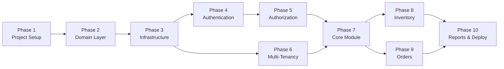

# IMS Implementation — Master Overview

> **Reference**: [IMS_Modernized_Architecture_Research.md](file:///c:/1%20-Tahyour/8%20-%20Projects/CRM/CRM%20-%20BE/IMS_Modernized_Architecture_Research.md)
> **Tech Stack**: ASP.NET Core 8+ · EF Core 8+ · Azure SQL · Microsoft Entra ID · Next.js

---

## Implementation Phases

| Phase  | Document                                                                                                                                                 | Focus Area                                                            | Estimated Effort |
| ------ | -------------------------------------------------------------------------------------------------------------------------------------------------------- | --------------------------------------------------------------------- | ---------------- |
| **1**  | [Project Setup & Foundation](file:///c:/1%20-Tahyour/8%20-%20Projects/CRM/CRM%20-%20BE/docs/implementation-steps/01-Project-Setup-Foundation.md)         | Solution structure, NuGet packages, base classes, configuration       | 1–2 days         |
| **2**  | [Domain Layer — Entities & Enums](file:///c:/1%20-Tahyour/8%20-%20Projects/CRM/CRM%20-%20BE/docs/implementation-steps/02-Domain-Layer-Entities.md)       | All domain entities, value objects, enums, constants                  | 2–3 days         |
| **3**  | [Infrastructure — Database & EF Core](file:///c:/1%20-Tahyour/8%20-%20Projects/CRM/CRM%20-%20BE/docs/implementation-steps/03-Infrastructure-Database.md) | DbContext, configurations, migrations, seed data, repositories        | 2–3 days         |
| **4**  | [Authentication — Azure Entra ID](file:///c:/1%20-Tahyour/8%20-%20Projects/CRM/CRM%20-%20BE/docs/implementation-steps/04-Authentication-Entra-ID.md)     | Entra app registration, MSAL setup, JWT validation, user provisioning | 2–3 days         |
| **5**  | [Authorization & RBAC](file:///c:/1%20-Tahyour/8%20-%20Projects/CRM/CRM%20-%20BE/docs/implementation-steps/05-Authorization-RBAC.md)                     | Roles, permissions, policies, authorization handlers, menu filtering  | 2–3 days         |
| **6**  | [Multi-Tenancy](file:///c:/1%20-Tahyour/8%20-%20Projects/CRM/CRM%20-%20BE/docs/implementation-steps/06-Multi-Tenancy.md)                                 | Tenant resolution middleware, EF global filters, tenant isolation     | 1–2 days         |
| **7**  | [Core Module — Users, Roles, Menus](file:///c:/1%20-Tahyour/8%20-%20Projects/CRM/CRM%20-%20BE/docs/implementation-steps/07-Core-Module.md)               | User management, role assignment, menu CRUD, module management        | 3–4 days         |
| **8**  | [Inventory Module](file:///c:/1%20-Tahyour/8%20-%20Projects/CRM/CRM%20-%20BE/docs/implementation-steps/08-Inventory-Module.md)                           | Items, categories, batches, stock levels, barcode scanning, locations | 4–5 days         |
| **9**  | [Orders & Supply Chain Module](file:///c:/1%20-Tahyour/8%20-%20Projects/CRM/CRM%20-%20BE/docs/implementation-steps/09-Orders-Supply-Chain.md)            | Purchase orders, sales orders, suppliers, e-commerce integration      | 3–4 days         |
| **10** | [Reporting, Audit & Deployment](file:///c:/1%20-Tahyour/8%20-%20Projects/CRM/CRM%20-%20BE/docs/implementation-steps/10-Reporting-Audit-Deployment.md)    | Reports, audit trail, logging, CI/CD, Azure deployment, testing       | 3–4 days         |

**Total estimated effort: 23–33 working days**

---

## Dependency Graph

## Conventions Used Across All Phases

- **Naming**: snake_case for DB columns, PascalCase for C# properties
- **IDs**: `int` with `IDENTITY(1,1)`, except `AuditLog` which uses `long`
- **Soft deletes**: `IsDeleted` flag on `BaseEntity`, filtered by global query filter
- **Concurrency**: `RowVersion` (`byte[]`) on all entities
- **Auditing**: `CreatedAt`, `CreatedBy`, `UpdatedAt`, `UpdatedBy` on all entities
- **Tenant isolation**: `TenantId` column on all tenant-scoped entities
- **API responses**: Wrapped in `ApiResponse<T>` / `PagedResponse<T>`
- **Validation**: FluentValidation for all request DTOs
- **Mapping**: Mapster or AutoMapper for entity ↔ DTO
